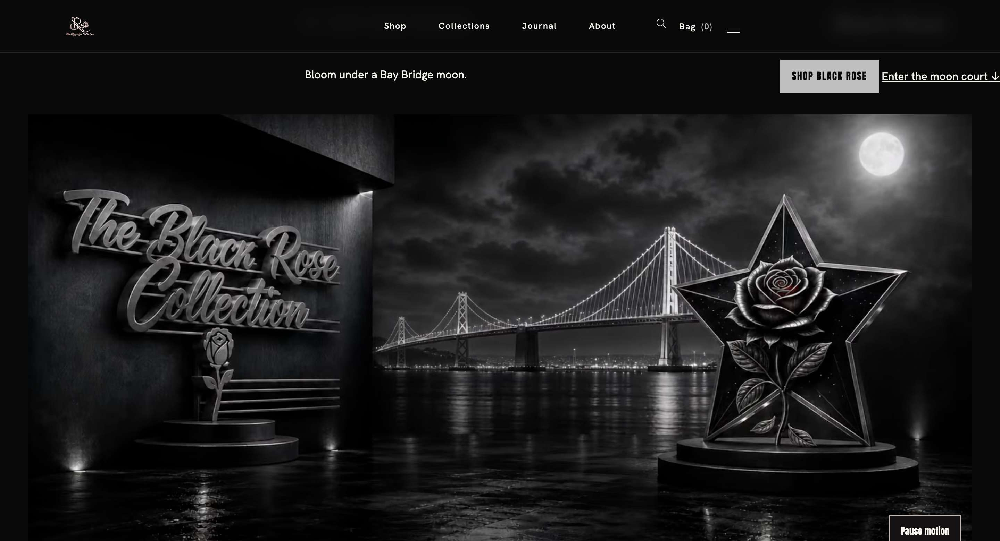
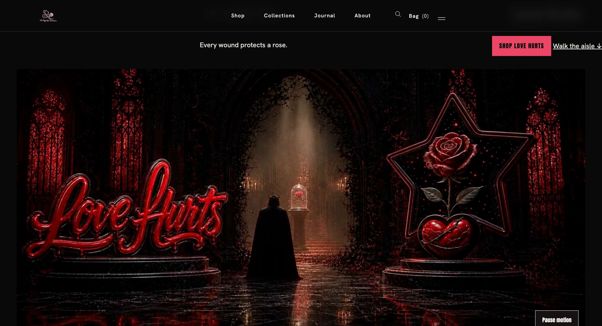
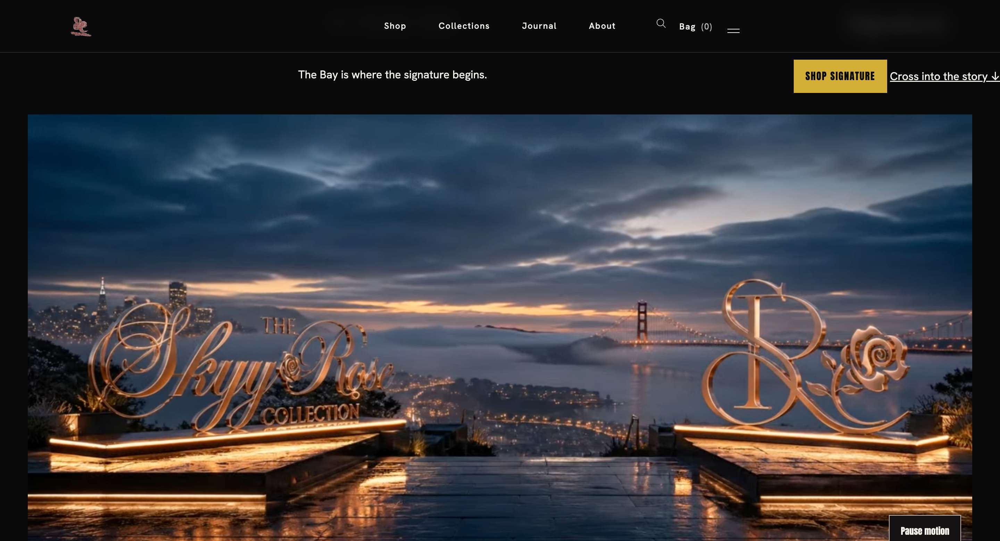
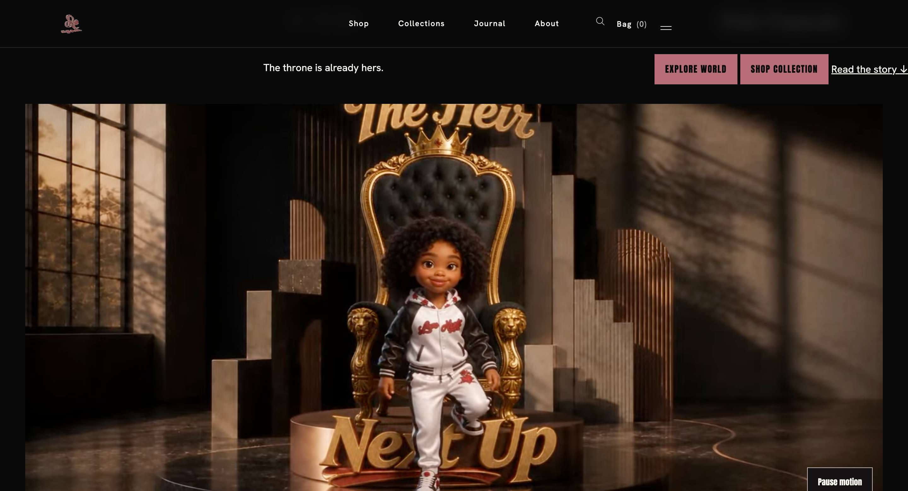
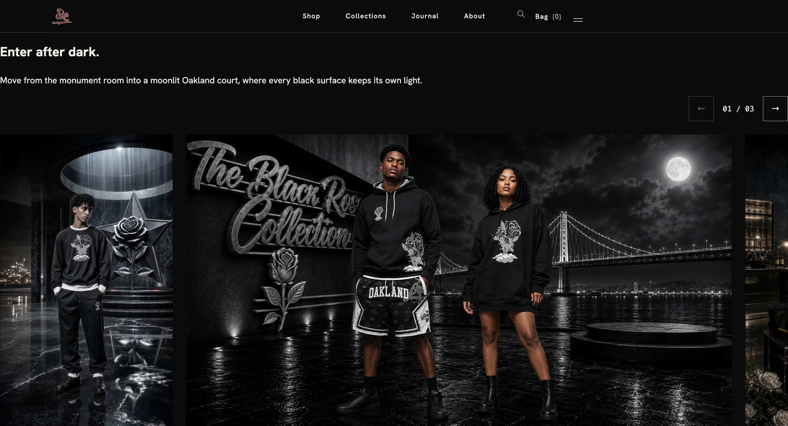
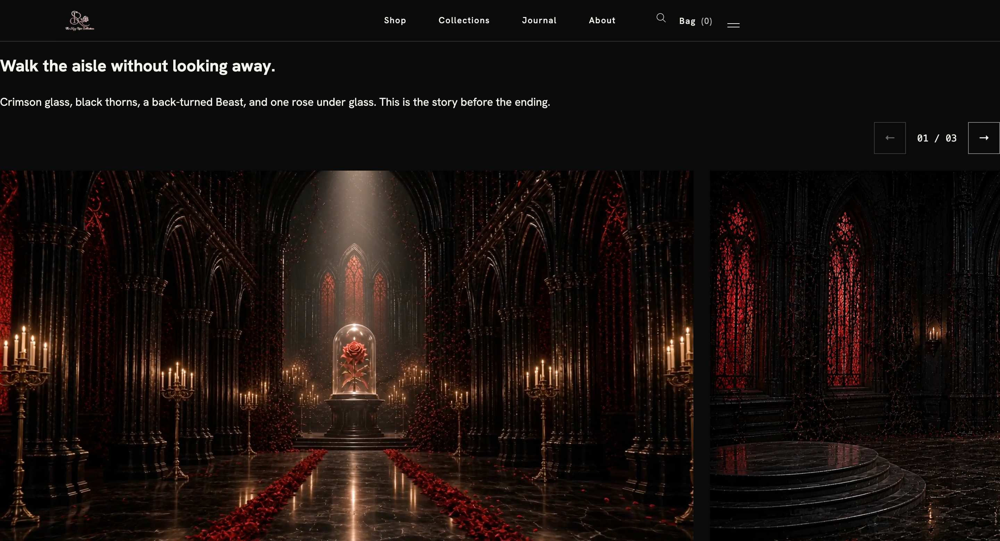
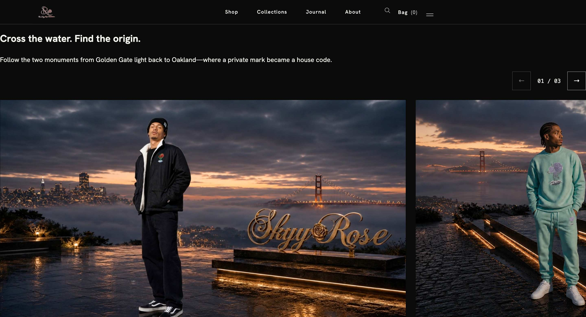

# Staging as the primary visual reference

Corey directed the investigation toward staging as the better view of the brand.
This is now the primary reference for **current visual expression**, with
production retained for drift comparison. Evidence E34–E36 and E41–E44 covers
the staging homepage, all four collection pages, and Kids mobile. These are
actual browser captures and eyes-on observations, not inferences from CSS alone.

## What the four worlds show

| World        | Observed visual mechanisms                                                                                                                                          | Shared grammar                                                                                                                   | Context-specific devices                                          |
| ------------ | ------------------------------------------------------------------------------------------------------------------------------------------------------------------- | -------------------------------------------------------------------------------------------------------------------------------- | ----------------------------------------------------------------- |
| Black Rose   | Silver sculptural collection lettering and star/rose emblem; moonlit Bay Bridge; reflective ground; on-model garment scenes                                         | Identity marks inhabit the scene, layered foreground/background, material response, place as narrative, garment-led continuation | Moon court, silver finish, specific bridge/night composition      |
| Love Hurts   | Crimson illuminated glass; reflective red lettering and cracked-heart/rose emblem; Beast viewed from behind facing a rose; long aisle and overhead light            | Symbols and narrative inhabit one coherent environment; depth and a controlled focal reveal                                      | Cathedral, Beast, enchanted rose, thorned aisle and crimson glass |
| Signature    | Warm bronze/gold wordmark and monogram; dusk skyline, fog/water and Golden Gate; on-model foreground with mint/lavender garments                                    | Place, emblem and clothing share a composed world; warm light articulates materials                                              | Specific overlook, bridge, monument pairing, dusk palette         |
| Kids Capsule | Child mascot at the center of a gold-trimmed throne; warm room; heir lettering and next-generation framing; mobile moves image and controls into a tall composition | Character agency, brand symbolism as spatial elements, narrative connection to product discovery                                 | Throne, royal room, mascot-led scene and three-chapter procession |

The portable observation is more specific than “dark luxury”: **collection
identity becomes an environment through marks, materials, light, place and a
narrative focal point; garment scenes connect that environment to products.**
This is a strong current visual-grammar candidate, not a new immutable identity
rule.

The visual sequence also matters: a symbolic world introduces the collection,
then on-body or product-linked scenes provide a route to actual pieces. It
supports a reusable separation between storytelling and transaction facts. A
rendered garment remains subject to exact SKU/view/source validation; these
screenshots do not certify each garment image.

## Hero evidence

### Black Rose

### Love Hurts

### Signature

### Kids Capsule

## Product-story continuation

The Love Hurts capture shows an environment-only frame within the story
sequence. It does not prove every frame depicts products. The DOM readback
supplies chapter/product links separately. Motion was not recorded as a complete
video, so these stills establish sampled states, not continuity or timing
quality.

## What changes in the reconciliation

- Current staging throne/cathedral scenes have greater evidentiary weight for
  present visual direction than older generic prompt prohibitions. The owner's
  preference for staging does not silently approve every possible reuse or turn
  a scene into master DNA.
- Signature visibly contains blue-gray sky. The historic “no blue” wording
  cannot be described as an accurate universal statement about current staging
  pixels. It remains a scope conflict: natural environment hues, interface
  colors, product colors and logo variants must be distinguished. No garment
  recolor or blanket palette reversal is inferred.
- The three inspected adult hero frames pair large sculptural lettering with an
  emblem. Kids instead centers a character. That difference is visual context,
  not a reason to force the adult composition onto Kids.
- The observed grammar can inform new campaigns without repeating a pedestal,
  bridge, aisle or throne. A future concept should explain how it carries the
  collection's identity and product truth, while its environment remains a
  scoped creative choice.
- Some initial collection captures show text/layout states different from later
  settled/mobile captures. No frozen deployment hash or full cache diagnosis was
  established. Treat layout defects or approval conclusions as unverified until
  separately tested.

## Capture scope

Guest browser contexts were used for the four collection pages. Desktop captures
were taken at a 1440×780 CSS viewport (2× screenshot density); Kids also at
390×844 mobile emulation. The homepage captures used an existing session with an
admin bar. This is visual archaeology, not a release, accessibility, payment or
cross-browser certification.
